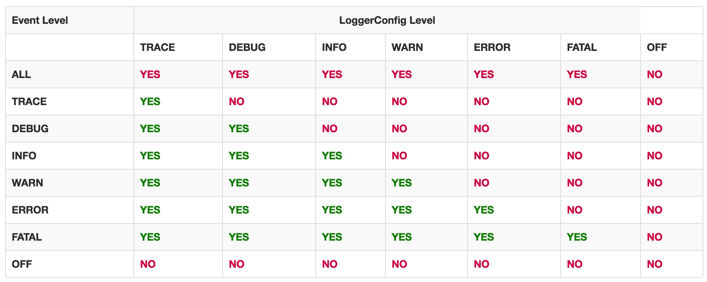

#log4j2配置
Log4j Event level和logger config level的关系:

(yes表示改级别为x的event能被配置为接收y级别的logger处理，反之）


```
<Configuration status=''>
```
配置根元素
status: 记录级别

```
<Appenders name='' target=''>
```
用于连接日志打印的目标（desc）,允许多个子元素
name: appender的名字
target: append的目标

``` 
<Loggers name='' additivity='unless root logger' level=''>
```
logger类型，包括root和其他
name: logger名字
additivity: 设定logger event只被处理一次
level: 设定logger处理的event level


