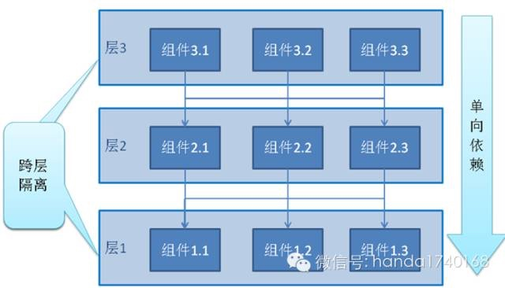
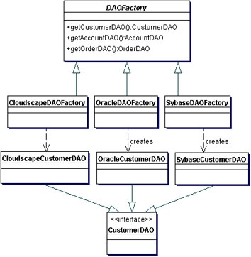
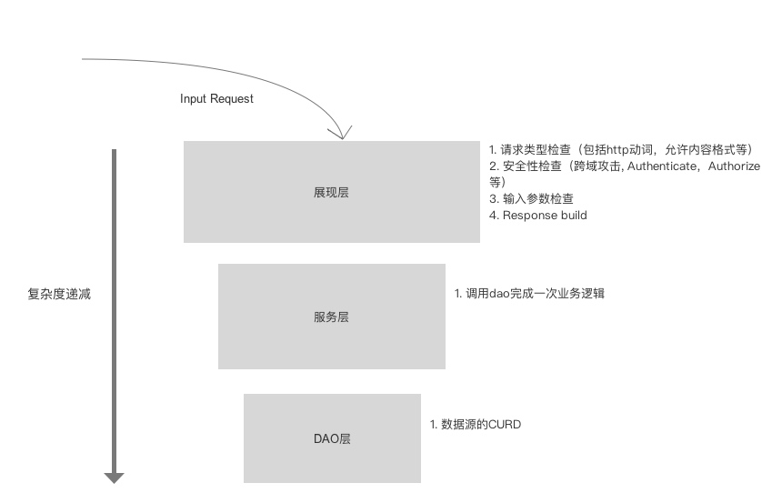

# 分析

现状：  

1. 架构分几层？
    * 三层，展现层（Controller）－> 服务层(Service) －> DAO层(DAO)，model准确来说不是一层，它是在三层间做一个传输对象。
2. 每层干什么事情？  
    * Controller: 获取输入参数，验证输入参数，打开数据库连接，调用Service完成业务逻辑。
    * Service: 一部分方法拼装SQL，调用DAO获取数据，一部分方法直接调用DAO接口。
    * DAO: 拼装SQL，执行SQL获取数据。  

分层架构是很有效的架构，它将一个系统纵向划分为各个层次，各个层次拥有相应职责，每个层次是职责相似但功能不同的一组模块集合，每个层次都是一个良好的封装，为上层提供接口和功能。我们在大架构上是没有什么问题，目前系统的问题主要集中在每个层次的细节上，每个层次的职责界定不清晰，可扩展型不足，具体以下阐述，重点在于DAO。

（参考http://mp.weixin.qq.com/mp/getmasssendmsg?__biz=MzA5ODExMTkwMA==#wechat_webview_type=1&wechat_redirect ）

```
* dao层，未提供良好的封装，可扩展型性不足，SQL难以管理和维护。
```

1. 使用泛型DAO，有利有弊，一方面抽象了CURD操作代码，提高代码质量，但另一方面系统一定存在SQL定制的需求，这种需求是不可预见，无法抽象，所以导致DAO必须提供以SQL为参数的方法给上层调用，来满足特殊的SQL需求。但这一举就破坏了DAO层的封装性，将数据库细节暴露给其他层次（比如上层写特殊SQL就必须要知道表名，表字段才能写出正确的SQL），并且导致SQL混乱，SQL充斥在不同的层次。随着项目增大，随之而来的就是维护，修改的巨大困难。在不换数据源的情况下，假如数据库表名或者字段名有修改，那么相关联的SQL都要找出并改动，因为SQL可能存在很多地方，那么定位SQL和修改SQL将成为灾难。而如果数据库换源，假如决定使用其他数据库产品，那么这个改动就更大。所谓牵一发而动全身。

2. 数据源的连接管理没有纳入DAO中，做为数据访问对象的一部分职责－数据源连接的关闭和打开，是没有理由要放到全局层次里去。

3. 面向未来，系统的数据源可能不止来自数据库，文件系统，内存数据库系统皆可能是数据来源。而使用单一的泛型DAO如果要包含各种类型的数据源，那么它将会变得无比巨大，难以维护。无法在这样的DAO上做一个良好的扩展。

重构建议：将所有DA相关的逻辑封装在DAO层次中，固定住它的职责和边界，对外只提供接口，不提供操作SQL或者任何操作数据细节的可能，保持其封装性质。建立可扩展的DAO层，不同DAO的实现互不耦合，冲突，提高扩展型，具体入下。

1. 横向扩展上，采用DAO Factory模式，泛型DAO作为其中一种DAO Factory保留，只需在实例化DAO的地方使用GenericDAOFactory实例化泛型DAO即可兼容老代码。然后在此基础上增加新的DAO Factory，比如MybatisDAOFactory。这样既可以兼顾老的DAO，又可在新基础上横向扩展新的DAO实现。

  （参考http://www.oracle.com/technetwork/java/dataaccessobject-138824.html ）

2. 纵向封装上，将数据源连接的管理封装在Factory中。

目前Java DAO框架中，Mybatis十分灵活。它的SQL都统一配置在XML文件里面，而且对外只提供接口调用，用户是无法直接操作到SQL，并且Mybatis XML提供动态SQL的语法，提供数据源适配，不同的数据库可自动识别并使用相应的SQL语法，一个设计良好的动态SQL可以使用在很多场景。另外如果有特殊化的SQL需求，只需配置一个新的SQL，创建一个新的接口就可以完成，既不破坏封装性质，又保留了SQL的灵活。所以特别推荐引入这个DAO框架，可有效重构DAO层。

```
* 展现层（Controller），微框架提供功能有限，页面和数据耦合，难以调试。
```

1. Spark只是个微框架，基本上是个Servlet的壳，要做复杂应用，还是得自己写很多东西。  

2. 严格来说，我们的展现层算不上是Restful，因为既没有遵守最基本的URL规范（不能出现动词，Restful URL只是表示一个资源的位置），也没有遵守Restful对于HTTP动词的语义（POST代表增加一个新资源，GET获取，PUT全量更新，PATCH部分更新，DELETE删除，并且每个动词有不同的幂等性），使用场合不算严谨。另外还缺少HTTP Status状态的映射，所有的异常应该要映射到对应的HTTP状态码，比如参数有问题要返回BadRequest(400)，验证不通过要NotAuthenticated(401)等。  

3. 展现层是不应该耦合数据库的连接逻辑，这是DAO层的职责。

4. 页面和数据耦合。

5. 存在业务逻辑。

重构建议：

```
* Service层，封装不足，简单映射DAO的CURD
```

1. Service层的职责应该是提供给上层调用完成一次业务逻辑，一次业务逻辑并不只是CURD，比如一次登陆，展现层收到登陆的参数验证后发送给Service层，此时Service层应该包括验证，Session注册在内的两个逻辑，而不是仅仅GetUserByName()。而目前Service的业务逻辑往上层移动，在Controller里有部分业务逻辑，体现了Service的封装不足。

重构建议：分析每个请求代表的具体业务，将Controller的业务逻辑后移到Service。

```
* domain（Model）
```

1. 贫血的模型


# 重构顺序



我理解中的分层架构中，底层DAO是整个后端的基础，所有层次算是从这个层次派生而来，并且它和外界最不相关，受外界参数干扰产生异常的复杂度最低，所以这一层重构的复杂度要比上层要低，因此我建议重构先从DAO层起，逐步往上。如果直接从展现层开始，这样的重构相当于空中阁楼，很容易崩塌，而前端直接和展现层接触，展现层没有重构完，也不建议先引入vue.js。


